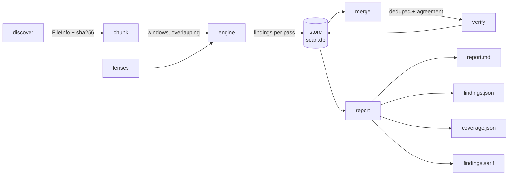

# Architecture

Eight modules, one SQLite file, no server. The design constraint that shapes
all of it: **nothing may be silently dropped**, because a review tool you
cannot audit is a review tool you cannot trust.

## Overview

## Components

| Module | Responsibility |
|---|---|
| `cli` | Argument parsing, the scan orchestrator, the worker pool, progress and the `multi` rollup. |
| `discover` | Walks the tree, classifies language, hashes content, records a status for **every** file including the skipped ones. Splits large files into overlapping windows. |
| `lenses` | The seven prompt templates. One defect class each; the catalogue is data, not code. |
| `engine` | The Anthropic client: retries, extended thinking, response parsing, and the `--fake` offline stub. |
| `store` | SQLite state, keyed by content hash. Tasks and their findings are written in one transaction. |
| `merge` | Deduplicates findings across passes, computes agreement, scores priority. |
| `report` | Markdown, JSON, coverage and SARIF 2.1.0 output. |

## Data flow

1. **Discover.** Every file under the root gets a row: eligible, or skipped
   with a reason. Content is hashed — the hash is the resume key.
2. **Chunk.** Files longer than `--chunk-lines` become overlapping windows, so
   a defect spanning a boundary is not invisible to both sides of it.
3. **Plan.** The task list is the cross product `files × chunks × lenses ×
   repeats`. Tasks already recorded `done` for the same content hash are
   dropped from the plan — that is the whole of resume.
4. **Run.** A thread pool executes the remaining passes. Each result — success
   or failure — is written as a row. A failure is a recorded task with an error
   string, never an absence.
5. **Merge.** Overlapping findings collapse into one, carrying a count of how
   many independent passes agreed.
6. **Verify** (optional). A second-opinion call per finding above the severity
   floor. Rejected findings are marked, not deleted.
7. **Report.** Coverage first, then findings by priority.

## Decisions

**SQLite, not a JSON file.** Resume has to survive `kill -9` mid-pass. A
transaction per task means a task is either fully recorded with its findings or
absent and therefore retried; there is no half-written state to reconcile.

**Content hash, not mtime.** Editing one file rescans exactly that file. A
checkout, a rebase or a clone does not invalidate a scan that is still valid.

**One connection per thread.** The worker pool both reads and writes. A single
shared connection with a lock on the writers only lets a worker's read land
inside another worker's open transaction, which SQLite reports as "bad
parameter or other API misuse". Per-thread connections plus WAL keep the read
paths lock-free; the lock now only serialises the multi-statement write.

**Narrow lenses, not one big prompt.** An undirected review drifts toward
whatever is most obvious in the file. Seven focused passes cost more and find
categories a general pass structurally will not reach.

**Agreement over confidence.** A model's self-reported confidence is not
calibrated. How many independent passes flagged the same thing is a signal that
comes from outside any single call, which is why the report sorts on it.

**Findings never set the exit code.** Whether a finding should fail a build is
policy, and policy belongs in the caller. The CLI reports; the workflow decides.

## What this structurally cannot do

Recorded here because the failure mode of a tool like this is being trusted
more than it deserves.

- **It does not find everything.** LLM review is sampling. More passes raise
  recall but never to 100%. A clean report means "these passes found nothing".
- **It cannot execute your code.** Anything depending on runtime state, timing,
  real data or actual configuration is invisible. Fuzzing, property tests and
  integration tests find defects this cannot.
- **It sees one file at a time.** Defects that exist only in the interaction
  between modules are mostly missed. The `assumptions` field marks where the
  model was reasoning about code it could not see.
- **It produces false positives.** `--verify` cuts them substantially, not to
  zero.
- **It does not replace Semgrep, CodeQL, dependency scanning or secret
  scanning.** Those are deterministic, free, and catch the boring majority.
  This is for the reasoning-dependent defects they cannot express.
